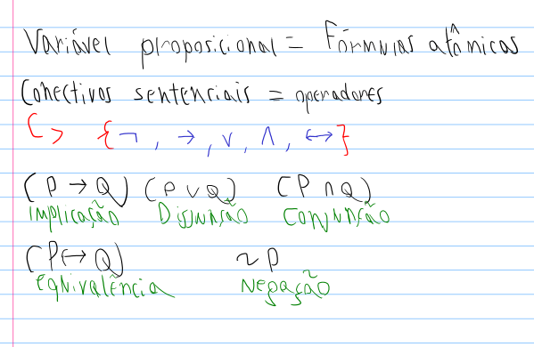
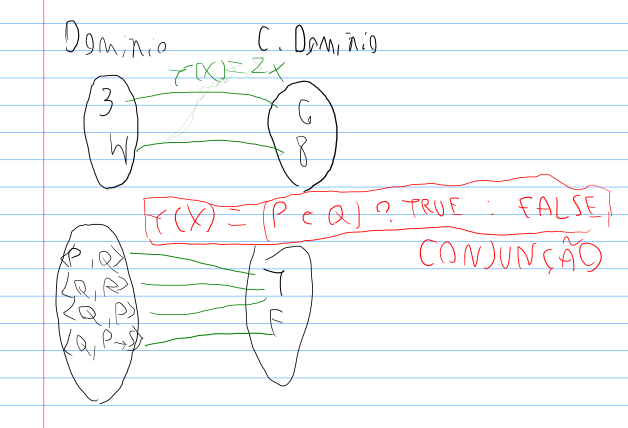

- **Alfabeto:** conjunto de símbolos que formam palavras 
de uma linguagem. Variável proposicional = Fórmulas atômicas
- **Gramática:** conjunto de regras que determinam 
como  as  palavras  e  os  símbolos  do  alfabeto  devem 
ser combinados para formar sentenças. 
- **Sentenças:** sequencia de palavras que obedecem a 
certas regras gramaticais e semânticas. 
- **Proposição:** sentença declarativa que pode ser 
interpretada como verdadeira ou falsa
    - Exemplo: A lua é um satélite da terra
    - Isso é uma proposição

## Proposições
- **PRINCÍPIO DO TERCEIRO EXCLUÍDO:** uma proposição só pode ser verdadeira ou falsa, não havendo outra alternativa
- **PRINCÍPIO DA NÃO CONTRADIÇÃO:** uma proposição não pode ser ao mesmo tempo verdadeira ou falsa

## COMP[H]
- Se H é simbolo verdade ou proposicioal, então COMP[H] = 1
- Se ~H é fórmula proposicional, então COMP[~H] = COMP[H] + 1
-  Se (P * Q) é uma fórmula proposicional, sendo * um dos conectivos binários, então
COMP[P * Q] = COMP[P] + COMP[Q] + 1;
- **O comprimento se define contando os conectivos**

## Subfórmulas
- Conjunto formado pelas subfórmulas de uma fórmula proposicional;
- Contém todos os pedaços dessa fórmula inclusive ela mesma

# Revisão detalhada
- Lógica proposicional -> dedução natural: usa regras de inferência para derivar conclusões a partir de premissas. Foca na estrutura das fórmulas por meio de regras para cada conectivo lógico.
- Eles são verofuncionais e binários. Pois é necesssário no mínimo dois valores pra ter o resultado valido. Ex: P implica Q é uma função, P e Q (fórmulas) sendo os parâmetros da função (->)
- Isso é válido EXCETO para o conectivo de negação, que só precisa de uma fórmula

## Funções
- As operações nada mais são que funções
- Temos um conjunto de pares como {p,q} que passam por uma função de conjunção
- A regra dessa função de conjunção é que P e Q devem ser verdadeiros

## Princípio de composicionalidade
- O significado de uma sentença é uma função do significado dos seus constituintes.
- Ou seja, descobrindo o valor das fórmulas atômicas conseguimos determinar o valor através da semântica. A semântica permite interpretarmos os operadores/funções verofuncionais