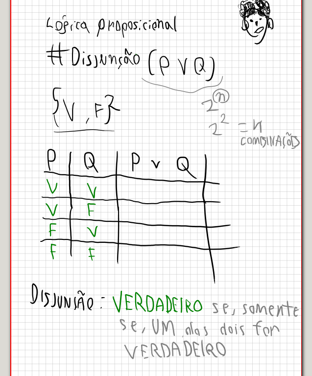
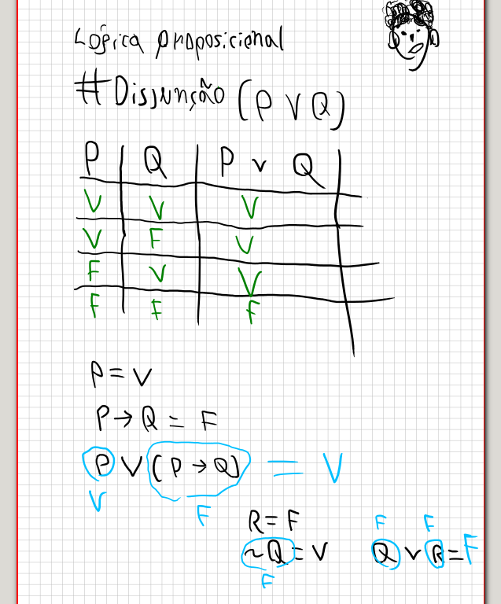
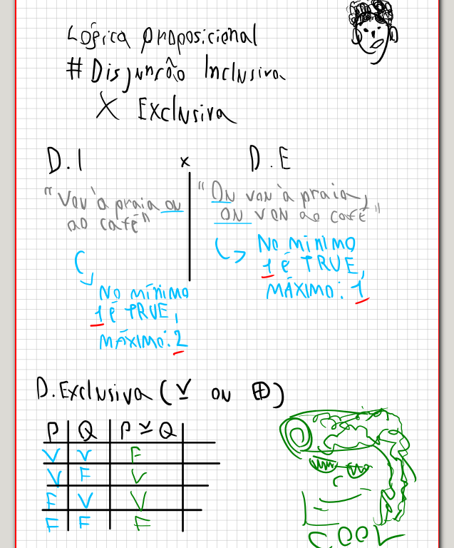

# Disjunção
- Só é VERDADE SE,e SOMENTE SE, um dos dois for VERDADEIRO

## Notas
- OBS: Tabela verdade é um conceito semântico apenas. A parte axiomática é sintática. Lidamoas com a dedução natural, por isso precisamos da tabela.

- Com a tabela verdade conseguimos montar todas as interpretações possíveis dentro da lógica binária, entendendo os operadores;

## Disjunção inclusiva
- Quando uma das duas FÓRMULAS é verdade e as DUAS PODEM ser verdadeiras

## Disjunção exclusiva
- Quando uma das duas fórmulas é verdade e SOMENTE UMA pode ser verdade

