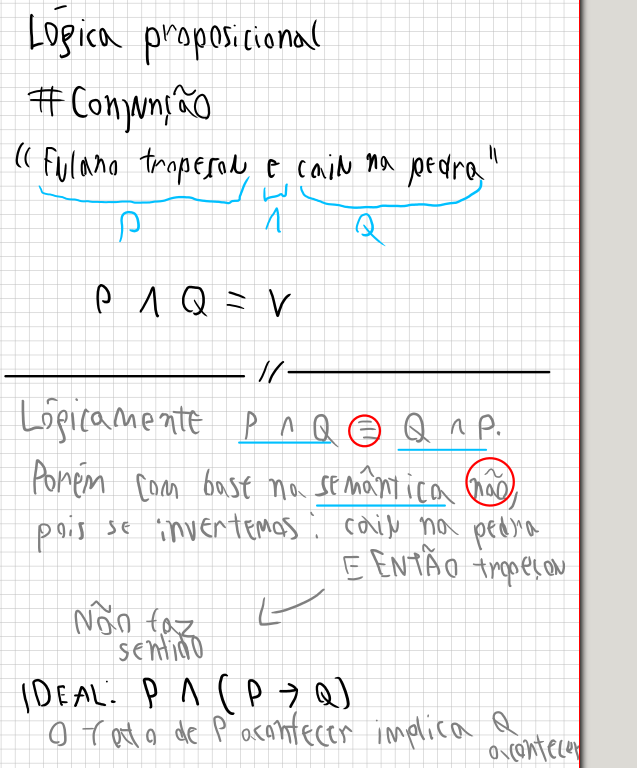

# Conjunção
- Quando AMBAS fórmulas são VERDADEIRAS
- "Fulano tropeçou na pedra e caiu"
- P ^ Q = V | Q ^ P = V | P ^ Q = Q ^ P
- Contudo P ^ Q = Q ^ P semânticamente é incorreto pois não tem como o efeito vir antes da causa "caiu e então fulano tropeçou"
- Então nesse caso a representação de P ^ Q seria melhor como:

 

## CONCLUSÃO
- Se houver relação causal, talvez P ^ Q não seja igual a Q ^ P