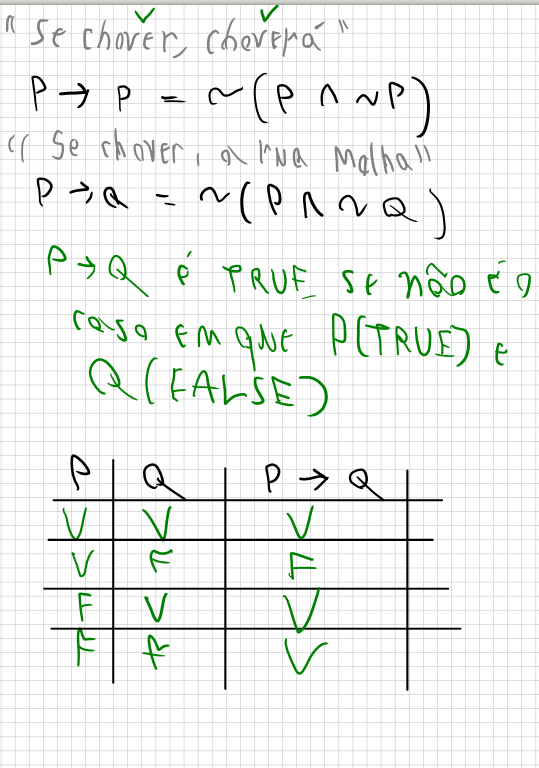

# Implicação
- A implicação tem uma relação de antecedente e consequente, SE ENTÃO;

1. "SE CHOVER, CHOVERÁ"
P = SE CHOVER
P = CHOVERÁ

**P -> P:** nesse caso o P implica em P e só pode ser verdadeiro, pois se não chover, não tem como "choverá" e se chover, não tem como "não choverá"
    - pode ser descrito também como ~(p^~P), que é NÃO(se chover, não choverá)
    - uma TAUTOLOGIA (verdadade lógica)

2. "SE CHOVER, A RUA MOLHA"
P = SE CHOVER
Q = A RUA MOLHA
**P -> Q:** nesse caso o P implica em Q e só pode ser verdadeiro, pois, se CHOVE, a rua não tem como "não molhar" e se não chover, não tem como a rua molhar
    - pode ser descrito também como ~(P^~Q)
    - uma CAUSALIDADE

3. "SE FULANO É CASADO, FULANO É HOMEM"
C = SE FULANO É CASADO
H = FULANO É HOMEM

**C -> H:** SE fulano é Casado, não tem como fulano NÃO SER HOMEM, pois o 'Casado' está em concordância com o gênero
    - Pode ser descrito como ~(C ^ ~Q)
    - Implicação semântica

4. "SE O FLAMENGO GANHAR, TE DOU 100"
**G -> D:** Verdadeiro pois SE o flamengo ganhar, eu tenho que dar o dinheiro, não posso FLAMENGO GANHAR E "não dar dinheiro"
- Pode ser descrito como: ~(G ^ ~Q)
    - Escolha pessoal

## 4 Casos bem diferentes de sentenças da lingua portuguesa que utilizam da implicação
- Quando é formalizado lógicamente vemos que mesmo sentenças diferentes, seguem a mesma fórmula
- Lógica é uma linguagem formal, quando formalizamos perdemos algumas informações, não tem como saber R -> S sem a sentença.

## Como lê-se então?
- Não lê-se "Se P, então Q", pois quando fazemos isso, implicitamente raciocinamos que tem uma causalidade aí, P sendo a causa de Q, mas não há causalidade na lógica

- O P -> Q lê-se como "Se não é o caso em que P é verdadeiro e Q é falso" = ~(P ^ ~Q)

- Parece bastante contra intuitivo, pois a lógica não foi pensada para essas questões envolvendo causalidade e outras sentenças extra-lógicas. Mas se for parar pra pensar usamos muito no cotidiano

    "Se você correr essa maratona, então eu sou o Super-Homem"

    Você sabe que "se você correr essa maratona" é falso, pois o amigo é sedentário
    Como o antecedente é falso, a sentença inteira é verdadeira.

## tabela verdade

